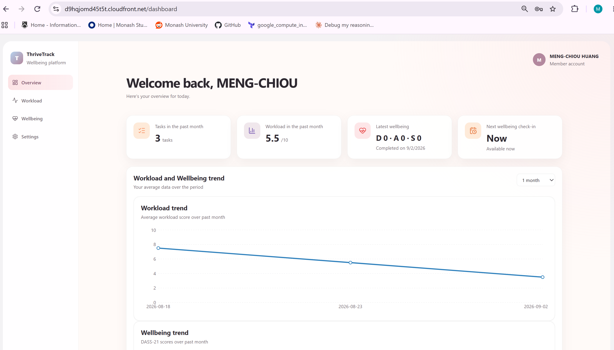
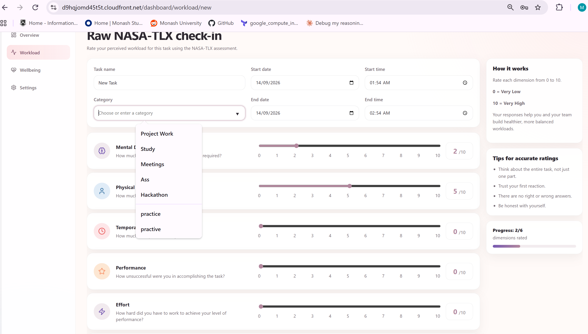
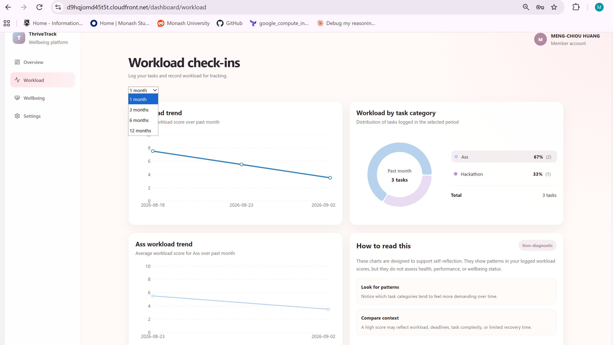
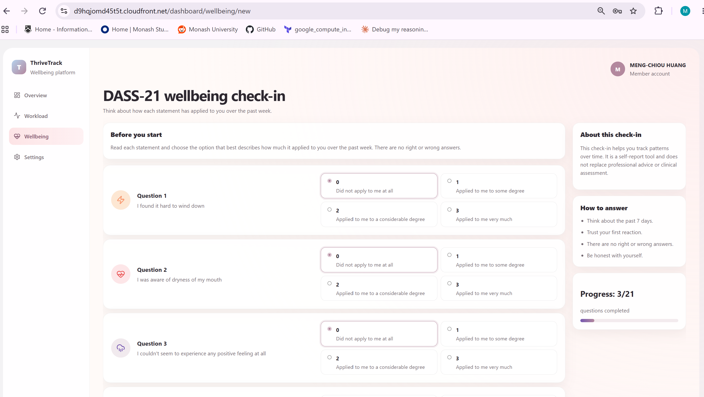
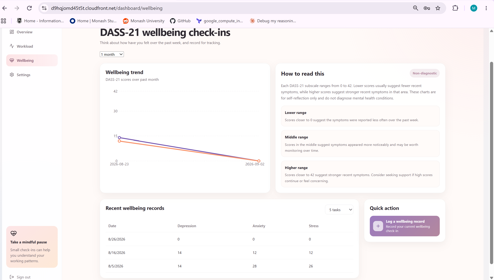
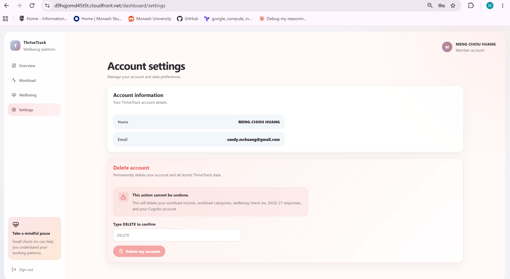

# ThriveTrack

ThriveTrack is a full-stack cloud-based workload and wellbeing tracking platform. It allows users to record task workload, complete weekly wellbeing check-ins, view personal trends, and manage their account data.

The project focuses on personal self-reflection rather than clinical diagnosis. Workload tracking is based on NASA-TLX inspired workload dimensions, while wellbeing check-ins use DASS-21 scoring for depression, anxiety, and stress subscales.

The project uses a serverless AWS architecture:

- AWS Cognito manages user registration, sign-in, password reset, and JWT authentication.
- API Gateway HTTP API exposes protected backend routes.
- AWS Lambda hosts backend business logic.
- Amazon RDS PostgreSQL stores workload and wellbeing data.
- Amazon S3 and CloudFront host and serve the React frontend.
- GitHub Actions automates frontend deployment and Lambda code deployment.
- Amazon EventBridge and Amazon SES were used to implement and test a scheduled wellbeing reminder workflow.

## Project Directory

```text
.
|-- backend/
|   |-- common/           Shared API response, authentication, and database utilities.
|   |-- database/         PostgreSQL migration scripts for Amazon RDS.
|   |-- functions/        Python AWS Lambda function source code.
|   |-- layers/           AWS Lambda layer files, including the psycopg dependency layer.
|   |-- .env.example      Example backend environment variables.
|   `-- requirements.txt  Python dependency list for backend Lambda functions.
|-- docs/
|   |-- deployment/       Deployment workflow examples.
|   |-- images/           Screenshots used in the README.
|-- frontend/
|   |-- public/           Static public assets.
|   |-- src/              React application source code.
|   |-- .env.example      Example frontend environment variables.
|   |-- package.json      Frontend dependencies and scripts.
|   `-- vite.config.ts    Vite configuration.
|-- .env.example          Example root environment variables, if used.
|-- .gitignore            Git ignore rules for dependencies, secrets, build outputs, and local artifacts.
|-- LICENSE
|-- package.json          Root package configuration, if used for shared scripts.
|-- package-lock.json
`-- README.md             Top-level project overview and setup guide.
```

## Main Features

- **Workload recording:** Users can log tasks with category, time range, and NASA-TLX inspired workload ratings, helping them reflect on which tasks feel most demanding.

- **Workload dashboard:** Users can view workload trends, category distribution, and recent records, making it easier to identify workload patterns over time.

- **Weekly wellbeing check-ins:** Users can complete DASS-21 based check-ins for depression, anxiety, and stress subscales. The feature is for self-reflection only and does not provide diagnosis or medical advice.

- **Wellbeing dashboard:** Users can review their latest wellbeing scores and observe changes across previous check-ins, supporting longitudinal self-awareness.

- **Secure personal access:** Cognito authentication and JWT-protected APIs ensure records are linked to the authenticated user.

- **Account data control:** Users can permanently delete their account and application data, supporting privacy-aware data management.

- **Cloud deployment workflow:** The project demonstrates a full-stack AWS deployment using S3, CloudFront, API Gateway, Lambda, RDS PostgreSQL, Cognito, and GitHub Actions workflow examples.

- **Reminder workflow prototype:** A scheduled wellbeing reminder workflow was implemented and tested with EventBridge, Lambda, RDS, and SES, demonstrating how reminder-based engagement could be added in production.

## Prerequisites

Install the following tools before running or deploying the project:

- Node.js and npm
- Python 3.12+
- AWS CLI v2
- PostgreSQL client tools, optional for inspecting the deployed database
- Git

Terraform is planned for future infrastructure automation but is not required for the current deployment.

## Frontend Setup

Create an environment file under `frontend/.env`:

```bash
VITE_API_URL="<Actual API Gateway HTTP API URL>"
VITE_COGNITO_REGION="<Actual Cognito Region>"
VITE_COGNITO_USER_POOL_ID="<Actual User Pool ID>"
VITE_COGNITO_USER_POOL_CLIENT_ID="<Actual User Pool Client ID>"
```

Run the frontend locally:

```bash
cd frontend
npm install
npm run dev
```

Useful frontend commands:

```bash
npm run build
npm run preview
```

## Backend Setup

Backend application code is stored under `backend/`:

Backend application code is stored under `backend/`:

- `backend/functions/` contains Python Lambda handlers.
- `backend/common/` contains shared authentication, database, and API response utilities.
- `backend/database/` contains PostgreSQL migration scripts.
- `backend/layers/` contains Lambda layer files for Python dependencies.

Database-connected Lambda functions connect to Amazon RDS PostgreSQL through environment variables:

```bash
DB_USER="<Database username>"
DB_PASSWORD="<Database password>"
DB_HOST="<RDS endpoint>"
DB_PORT="5432"
DB_NAME="<Database name>"
```
Do not commit real database credentials or local environment files.

## Cloud Deployment

The application was previously deployed on AWS for testing and demonstration. The public AWS resources have been removed to avoid ongoing cloud costs.

The frontend was deployed as a static Vite build to S3 and served through CloudFront. GitHub Actions built the frontend, uploaded the `dist/` folder to S3, and created a CloudFront invalidation.

Lambda functions were deployed through GitHub Actions. Each Lambda was packaged with shared backend utilities from `backend/common` and updated through the AWS CLI. Example GitHub Actions deployment workflows are stored under `docs/deployment/`. They are not active in the public repository because the original AWS resources were removed.

Protected backend routes were exposed through API Gateway HTTP API and used Cognito JWT authorisation.

## Architecture Overview

```text
User
  ↓
CloudFront
  ↓
S3 static frontend
  ↓
React + TypeScript application
  ↓
API Gateway HTTP API
  ↓
Cognito JWT authorizer
  ↓
AWS Lambda functions
  ↓
Amazon RDS PostgreSQL
```

The frontend obtains a Cognito ID token after sign-in and attaches it to protected API requests. API Gateway validates the JWT before forwarding the request to Lambda. Lambda functions use the Cognito `sub` claim as the user identifier when reading or writing records in PostgreSQL.

## API Routes

### Workload

```text
POST /workload-record
GET  /workload-record
GET  /workload-categories
GET  /workload-summary
```

### Wellbeing

```text
POST /dass21-assessment
GET  /dass21-assessment
GET  /dass21-summary
```

### Account and Settings

```text
POST   /register-user
GET    /notification-settings
PUT    /notification-settings
DELETE /account-data
```

## Email Reminder Workflow

A scheduled wellbeing reminder workflow was implemented and tested using EventBridge, Lambda, RDS, and SES.

The public demo hides the email reminder UI because Amazon SES sandbox mode requires recipient email verification before delivery. This avoids requiring demo users to verify their email addresses through AWS SES. The backend workflow is kept as technical evidence and can be re-enabled in a production environment after configuring SES production access and domain authentication.

## Screenshots

Store screenshots under `docs/images/`.

### Dashboard Overview



### Workload Check-in



### Workload Dashboard



### Wellbeing Check-in



### Wellbeing Dashboard



### Account Settings



## Tests

The project currently focuses on manual end-to-end testing through the deployed CloudFront frontend and API Gateway backend.

Main tested flows include:

- user registration
- sign-in
- password reset
- workload record creation
- workload dashboard loading
- DASS-21 submission
- wellbeing dashboard loading
- account settings display
- account deletion
- frontend deployment through GitHub Actions
- Lambda deployment through GitHub Actions
- scheduled reminder backend workflow

Future improvements include automated backend integration tests and frontend smoke tests.

## Security and Privacy Notes

- Keep `.env`, database credentials, AWS credentials, and local configuration files out of commits.
- API routes are protected with Cognito JWT authentication.
- User data is linked to Cognito `sub` values rather than storing a separate user profile table.
- The application avoids storing unnecessary personal information.
- Account deletion removes user-linked application data and deletes the Cognito user account.
- RDS is accessed from VPC-enabled Lambda functions.
- DASS-21 results are used for self-reflection only and do not provide diagnosis, treatment, or medical advice.

## Known Limitations

- Infrastructure is currently configured manually rather than fully managed through Terraform.
- Email reminders are implemented but hidden in the public demo because SES sandbox mode requires recipient verification.
- Automated integration tests are planned as future work.
- The frontend production bundle can be further optimised with code splitting.

## Future Improvements

- Migrate AWS infrastructure provisioning to Terraform.
- Add frontend smoke testing to the deployment workflow.
- Add backend integration tests.
- Add a dedicated health-check endpoint.
- Add production SES access and domain authentication.
- Improve dashboard insights and longitudinal summaries.
- Improve frontend code splitting to reduce production bundle size.
